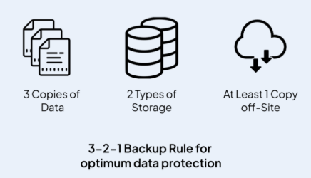
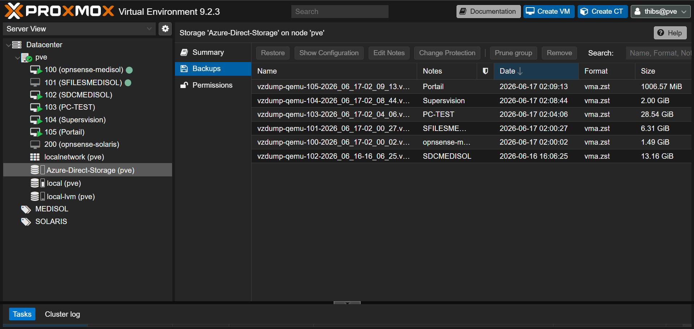
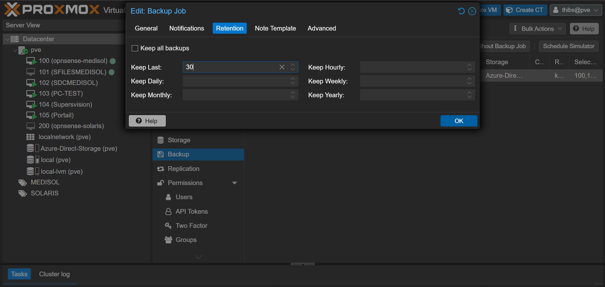
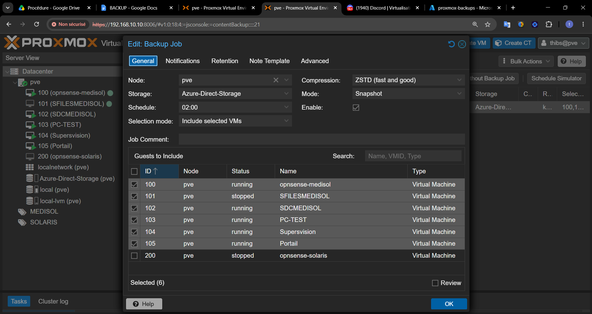
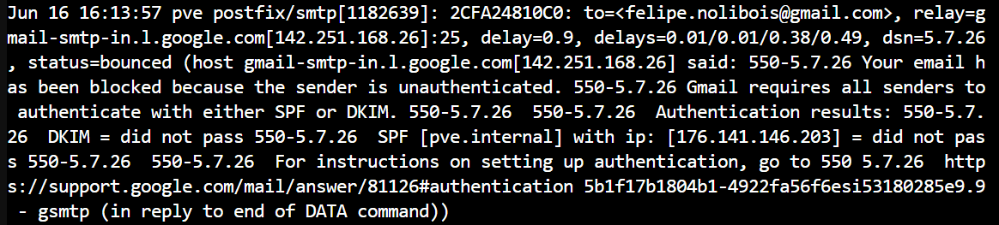

# DOCUMENTATION TECHNIQUE : PLAN DE REPRISE D'ACTIVITÉ (PRA)

Sauvegarde Externalisée Proxmox VE vers Microsoft Azure Blob Storage

# Introduction & Contexte Technologique

## 1\. La Règle d'or de la sauvegarde : Le 3-2-1

Pour garantir la sécurité des données de l'entreprise **MEDISOL**, l'infrastructure doit respecter la règle du 3-2-1 :

- **3** copies de données au total (1 copie de production + 2 copies de sauvegarde).
- **2** supports différents (Disques locaux LVM-Thin + Stockage Cloud).
- **1** copie externalisée hors site (Datacenter Microsoft Azure) pour se prémunir des risques physiques (incendie, vol, dégât des eaux) ou des cyberattaques (Ransomware).

## 2\. La contrainte technique initiale (Pourquoi la méthode classique a échoué)

Au départ, l'objectif était d'effectuer une sauvegarde locale dans le dossier temporaire de Proxmox (/var/lib/vz/dump), puis d'utiliser un script d'interception (_Hook Script vzdump_) pour synchroniser les fichiers vers Azure via Rclone.

**L'échec de cette méthode est dû à une contrainte physique d'espace disque :**

- Le volume total des 6 machines virtuelles de production pour notre POC (OPNsense, Active Directory Windows, Supervision, etc.) représente environ **51,5 Go** de données brutes compressées par nuit (la VM 103 pèse à elle seule 28,5 Go et la VM 102 Windows pèse 13 Go).
- La partition système de Proxmox (pve-root), qui héberge le stockage local, ne disposait que de **26 Go d'espace libre**.
- **Résultat :** Lors de la sauvegarde simultanée des VMs, le disque local atteignait instantanément 100 % de saturation, provoquant le plantage global du processus avec l'erreur Linux critique : No space left on device.

## 3\. La solution adoptée : Le Streaming Direct (Cloud Mount)

Pour contourner la limite physique des 26 Go locaux, nous avons mis en place un montage réseau direct sans cache local via l'utilitaire Rclone. L'hyperviseur Proxmox est "trompé" : il voit le conteneur Azure Cloud comme un disque dur physique local à l'espace infini. Les données de sauvegarde sont compressées et envoyées à la volée (_streaming_) à travers Internet, consommant 0 Mo sur le disque local du Proxmox.

## 

# Partie 1 : Configuration du Système (Shell Proxmox)

Les clés d'accès Azure étant déjà configurées dans le profil Rclone (azurecloud), les commandes suivantes permettent de créer la passerelle de streaming.

1\. Création du point de montage local dans l'arborescence Linux

mkdir -p /mnt/azure-direct

2\. Lancement du montage en streaming direct avec optimisations réseau (Amortisseur RAM)

rclone mount azurecloud:proxmox-backups /mnt/azure-direct \\

\--allow-other \\

\--buffer-size 128M \\

\--azureblob-chunk-size 64M \\

\--daemon

## Justification technique des options pour l'oral :

- \--allow-other : Permet au service système de Proxmox (vzdump) d'écrire dans un dossier monté par l'utilisateur root.
- \--buffer-size 128M : Alloue un amortisseur de 128 Mo dans la mémoire RAM du Proxmox pour lisser les micro-coupures et la gigue de la connexion Internet.
- \--azureblob-chunk-size 64M : Force Rclone à regrouper les données pour envoyer des blocs massifs de 64 Mo vers l'API Azure. Indispensable pour éviter l'erreur Bad file descriptor sur les gros fichiers (comme le Windows Server).
- \--daemon : Exécute le processus en arrière-plan afin de libérer le terminal.

## 

# Partie 2 : Configuration Graphique (Interface Web Proxmox)

### Déclarer la passerelle Azure dans Proxmox

1.  Aller dans Datacenter —> Storage —> Add —> Directory.
2.  Remplir l'onglet General :
    - ID : Azure-Direct-Storage
    - Directory : /mnt/azure-direct
    - Content : Sélectionner uniquement backups.
3.  Aller sur l'onglet Backup Retention :
    - Décocher _Keep all backups_.
    - Dans Keep Last, inscrire : 30.
4.  Cliquer sur Add.

### Planifier la tâche de sauvegarde automatique

1.  Aller dans Datacenter —> Backup —> Add.
2.  Configurer la tâche globale :
    - Node : pve
    - Storage : Azure-Direct-Storage (Le lien Cloud direct).
    - Schedule : Inscrire directement au clavier 02:00 (Lancement automatique à 2h00 du matin).
    - Selection mode : Include selected VMs —> Cocher les 6 VMs de production.
    - Mode : Snapshot (Sauvegarde à chaud, sans interruption de service pour les utilisateurs).
    - Compression : ZSTD (fast and good) (Le meilleur ratio vitesse/compression actuel).
3.  Cliquer sur Create.

# Partie 3 : Analyse FinOps & Optimisation Budgétaire

L'analyse FinOps (gestion des coûts cloud) est un élément central de ce projet. Elle justifie le choix de la rétention de 30 jours.

## 1\. Les paramètres d'Azure Blob Storage

- Région : Europe de l'Ouest (_West Europe_).
- Niveau d'accès : Cool Tier (Froid) —> Conçu pour les données de sauvegarde peu consultées.
- Redondance : LRS (_Locally Redundant Storage_ - réplication sur 3 disques du même datacenter).
- Tarif de base Azure : ~0,01 € / Go / mois.

## 2\. Le dilemme de la rétention : Pourquoi 7 jours = 30 jours (prix)

Le niveau _Cool Tier_ d'Azure applique une règle stricte : toute donnée déposée est facturée pour un minimum de 30 jours.

- Si on avait mis 7 jours de rétention : Proxmox supprimerait les fichiers au bout d'une semaine. Azure appliquerait alors une pénalité financière de suppression anticipée (_Early Deletion Fee_) pour les 23 jours manquants. On paierait pour 30 jours de stockage tout en n'ayant qu'une seule semaine d'historique.
- En mettant 30 jours de rétention : On conserve les fichiers durant tout leur cycle de vie minimal Azure. On exploite à 100 % ce que l'on paie, sans aucune pénalité.

### Estimation de la facture mensuelle MEDISOL

- Volume d'une nuit (Full Backup) : ~51,5 Go.
- Volume total cumulé au bout de 30 jours : $51,5 \\text{ Go} \\times 30 \\text{ jours} = \\mathbf{1\\ 545\\ \\text{Go}}$ (soit environ 1,5 To de données en continu).
- Coût du Stockage : $1\\ 545 \\times 0,01\\text{ €} = \\mathbf{15,45\\text{ € / mois}}$.
- Coût des Opérations (Requêtes d'écriture API) : Moins de 0,01 € / mois (seulement 6 fichiers transférés par nuit).
- Coût Total du PRA : ~15,46 € / mois pour un mois complet d'historique de sauvegarde hautement sécurisé.

# Partie 4 : Procédure de Restauration d'une VM (Disaster Recovery)

En cas de sinistre total (par exemple, si la VM 102 Windows subit une attaque par Ransomware), voici la procédure pour la restaurer à son état initial en quelques clics :

1.  Depuis l'interface Web de Proxmox, se rendre dans le menu de gauche et cliquer sur le stockage Azure-Direct-Storage (pve).
2.  Cliquer sur l'onglet Backups au centre de l'écran.
3.  Repérer la VM sinistrée (ex: vzdump-qemu-102...) et sélectionner la date saine souhaitée dans l'historique des 30 jours.
4.  Cliquer sur le bouton Restore tout en haut de la liste.
5.  Une fenêtre de configuration s'ouvre :
    - Storage : Sélectionner le stockage local de production où la VM doit être réinstallée (généralement local-lvm).
    - VM ID : Laisser l'ID d'origine (102) pour écraser la machine corrompue, ou en choisir un nouveau (ex: 202) pour remonter la sauvegarde à côté de la production à des fins de test.
6.  Cliquer sur le bouton bleu Restore.

_Proxmox va alors se connecter directement à Azure en streaming inverse, télécharger le flux compressé, reconstruire le disque virtuel brut sur le LVM-Thin et rendre la machine de nouveau opérationnelle._

_Pour valider le fonctionnement des alertes du Plan de Reprise d'Activité (PRA), j'ai analysé les journaux du service de messagerie Postfix de Proxmox._ > _Les logs confirment que la couche réseau est parfaitement opérationnelle : l'hyperviseur parvient à initier une session SMTP sur le port 25 avec le relais de messagerie de Google (relay=gmail-smtp-in.l.google.com)._

_Cependant, l'e-mail subit un rejet de type status=bounced accompagné du code d'erreur 550-5.7.26. Depuis le renforcement des politiques de sécurité de Google, tout serveur de messagerie doit montrer patte blanche. Mon environnement de TP émettant depuis un domaine purement fictif (pve.internal) sans enregistrements DNS SPF ou DKIM valides sur l'adresse IP publique de test, les mécanismes de protection antispam de Gmail bloquent légitimement le message._

_Pour corriger cela en production, l'entreprise MEDISOL utiliserait un relais SMTP d'entreprise authentifié ou un service tiers approuvé (ex: Brevo, Mailjet) pour signer les messages avec une clé DKIM valide._

