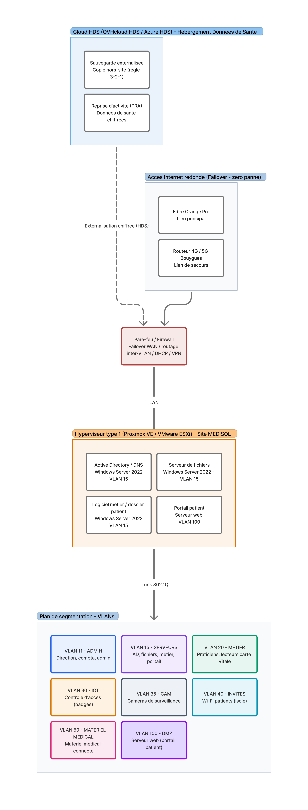

# MEDISOL — Mise en œuvre d'une infrastructure virtualisée sécurisée
### Rapport MSPR Virtualisation 

---

## Équipe

Ce rapport présente l'infrastructure réalisée pour la société fictive MEDISOL, centre de consultations et d'imagerie légère (bien-être / médecine douce).

| Nom Prénom |
|---|
| **EYHEREGARAY Yann** |
| **NOLIBOIS Felipe** |
| **DIJOUX--BREZOT Thibaut** |

---

## Résumé

MEDISOL est un centre de consultations et d'imagerie légère de 32 personnes, dont l'activité doit fonctionner en « zéro panne ». Le système d'information de départ présentait un serveur Windows obsolète, l'absence de segmentation, un Wi-Fi saturé, un logiciel métier lent et aucun exercice de reprise documenté.

L'équipe a déployé une infrastructure virtualisée sécurisée sous Proxmox VE, organisée autour d'un Active Directory redondé (deux contrôleurs de domaine), d'un réseau segmenté en VLAN filtré par le pare-feu OPNsense, d'une supervision Prometheus / Grafana dédiée, et d'une sauvegarde externalisée vers le cloud. La reprise d'activité a été validée par un test de bascule : l'arrêt du contrôleur de domaine primaire est repris par le secondaire. L'authentification de l'administration du pare-feu est elle-même adossée à l'annuaire Active Directory. Ce rapport décrit chaque brique mise en œuvre, la matrice de flux réellement appliquée et les preuves présentées à l'oral, puis les préconisations de durcissement.

---

## Sommaire

1. [Contexte et analyse de l'existant](#partie-1--contexte-et-analyse-de-lexistant)
2. [Analyse des risques](#partie-2--analyse-des-risques)
3. [Architecture déployée](#partie-3--architecture-déployée)
4. [Virtualisation et machines virtuelles](#partie-4--virtualisation-et-machines-virtuelles)
5. [Active Directory et redondance](#partie-5--active-directory-et-redondance)
6. [Sécurité réseau : segmentation, flux et authentification](#partie-6--sécurité-réseau--segmentation-flux-et-authentification)
7. [Supervision](#partie-7--supervision)
8. [Sauvegarde et reprise d'activité (PRA)](#partie-8--sauvegarde-et-reprise-dactivité-pra)
9. [Accès distant et services exposés](#partie-9--accès-distant-et-services-exposés)
- [Préconisations (durcissement)](#préconisations-durcissement)
- [Évolutions par rapport au sujet de base](#évolutions-par-rapport-au-sujet-de-base)
- [REX — Retour d'expérience](#rex--retour-dexpérience)
- [Conclusion](#conclusion)
- [Sources](#sources)

---

## Partie 1 — Contexte et analyse de l'existant

MEDISOL est un centre de consultations et d'imagerie légère orienté bien-être et médecine douce, employant une trentaine de personnes (accueil, praticiens, administration). Le planning est dense : une indisponibilité informatique désorganise immédiatement les consultations, d'où l'exigence de « zéro panne ».

Le système d'information de départ reposait sur un logiciel métier patient (client lourd Windows) vieillissant et lent aux heures de pointe, de l'imagerie légère stockée sur un serveur Windows, la télétransmission aux mutuelles avec lecteurs de carte Vitale, Microsoft 365 pour la collaboration, et un volet web (prise de rendez-vous en ligne, portail patient). Le parc comprend des postes d'accueil partagés, des praticiens nomades, des équipements de mesure connectés, ainsi que des caméras et un contrôle d'accès. L'ensemble fonctionnait sur un réseau à plat.

---

## Partie 2 — Analyse des risques

**Sécurité et conformité.** Sans segmentation, un patient connecté au Wi-Fi pouvait atteindre le réseau administratif ; le serveur obsolète comportait des failles ; les données de santé n'étaient pas isolées.

**Performance et disponibilité.** Wi-Fi saturé, logiciel métier lent, et aucun plan de secours malgré l'exigence de continuité.

**Mobilité.** Faute d'accès distant sécurisé, les praticiens nomades travaillaient sur papier hors site.

### Cadre d'analyse : le guide d'hygiène informatique de l'ANSSI

L'analyse des risques s'appuie sur le **guide d'hygiène informatique de l'ANSSI**, qui regroupe **42 mesures** de sécurité de base réparties par thèmes (sensibilisation, gestion des accès, sécurisation des postes et du réseau, administration sécurisée, nomadisme, mises à jour, sauvegarde, supervision). Confronté à ce référentiel, le système d'information de départ présentait plusieurs écarts, que l'architecture déployée vient combler :

| Thème ANSSI (guide d'hygiène) | Écart constaté à l'origine | Réponse apportée |
|---|---|---|
| Sécuriser le réseau (cloisonnement) | Réseau à plat, aucun cloisonnement | Segmentation VLAN + filtrage OPNsense (deny-by-default) |
| Authentifier et contrôler les accès | Pas de gestion centralisée des comptes | AD + MFA, modèle AGDLP, admin du pare-feu adossée à l'AD |
| Maintenir le SI à jour | Serveur obsolète, failles non corrigées | Migration vers Windows Server 2025 / Debian 12 maintenus |
| Sauvegarder régulièrement | Aucune sauvegarde fiable | Sauvegarde 3-2-1 (PBS + externalisation cloud) |
| Gérer le nomadisme | Accès distant non sécurisé (travail papier) | VPN WireGuard + MFA |
| Superviser, auditer, réagir | Aucun monitoring | Supervision Prometheus / Grafana + alertes |
| Sécuriser le Wi-Fi | Wi-Fi unique, saturé et non isolé | SSID séparés, VLAN INVITÉS isolé (portail captif) |

Ce cadrage relie chaque risque à une bonne pratique reconnue et justifie les choix techniques détaillés dans la suite du rapport.

---

## Partie 3 — Architecture déployée

L'architecture déployée applique une logique claire : les données sensibles et le cœur métier restent sur site, virtualisés et chiffrés, le réseau est segmenté par VLAN et filtré en deny-by-default, une supervision dédiée surveille l'ensemble, et le cloud est mobilisé pour la collaboration (Microsoft 365) et l'externalisation des sauvegardes.

***Figure 1 — Architecture déployée MEDISOL (centre de consultations).***

Le schéma se lit de haut en bas : la sauvegarde externalisée (cloud) en haut ; l'accès internet redondé ; le pare-feu OPNsense (routage inter-VLAN, DHCP, VPN) ; l'hyperviseur Proxmox VE et ses machines virtuelles ; en bas, le plan de segmentation par VLAN, dont le détail des flux autorisés figure en Partie 6.

---

## Partie 4 — Virtualisation et machines virtuelles

**Hyperviseur déployé : Proxmox VE** (type 1), sur un unique serveur physique doté de 16 Go de RAM. Ce choix se justifie par l'absence de coût de licence, sa maturité (KVM / LXC) et l'intégration de Proxmox Backup Server. Ce dimensionnement matériel (un seul hôte, 16 Go) conditionne fortement l'architecture : il impose la consolidation des rôles et interdit une véritable haute disponibilité matérielle (voir Partie 8.3).

**Consolidation pour des raisons pratiques.** Compte tenu des 16 Go de RAM disponibles, le nombre de VM est volontairement limité : le logiciel métier (client lourd), le serveur de fichiers et le contrôleur de domaine secondaire (DC2) sont regroupés sur une même VM. Le contrôleur primaire (DC01) reste isolé sur sa propre VM pour garantir l'indépendance des deux contrôleurs.

| Machine virtuelle | Système | vCPU | RAM | Stockage |Stockage préconisé | Rôle |
|---|---|---|---|---|---|---|
| **DC01** — Active Directory primaire | Windows Server 2025 | 2 | 4 Go | 50 Go | 80 GO |Authentification, DNS, GPO |
| **Serveur consolidé** — fichiers + logiciel métier + AD secondaire (DC2) | Windows Server 2025 (BitLocker) | 4 | 4 Go | 32 Go + 90 Go | 80 GO + 1 To | Partages, imagerie, client lourd, DC redondant + bitlocker |
| Portail patient | Debian 12 | 1 | 2 Go | 40 Go |40 Go | portail prise de rendez-vous patient
| Supervision | Debian 12 | 2 | 2 Go | 40 Go |40 Go| Prometheus, Grafana, Alertmanager |

Le total alloué (~12 Go) tient dans les **16 Go** de l'hôte, le reste servant de marge pour l'hyperviseur et le sur-engagement mémoire (KSM / ballooning de Proxmox). Les disques contenant des données de santé (imagerie, dossiers patients) sont **chiffrés (BitLocker)**.

---

## Partie 5 — Active Directory et redondance

L'**Active Directory** (domaine `medisol.local`) centralise l'authentification, le DNS et les stratégies de groupe pour l'ensemble des utilisateurs. Le provisioning des comptes et des groupes a été automatisé via un script PowerShell, garantissant un déploiement reproductible et un modèle de droits par métier puis par ressource (logique AGDLP).

Pour répondre à l'exigence de « zéro panne », l'annuaire est redondé : un contrôleur primaire (DC01) sur sa VM dédiée et un contrôleur secondaire (DC2) hébergé sur le serveur consolidé, les deux se répliquant mutuellement. Si l'un tombe, l'autre continue d'assurer l'authentification et la résolution DNS.

---

## Partie 6 — Sécurité réseau : segmentation, flux et authentification

### 6.1 — Plan de segmentation (VLAN)

Le réseau est segmenté par VLAN, déployés sur un commutateur administrable et filtrés par le pare-feu OPNsense, qui assure le routage inter-VLAN, le DHCP et la terminaison du VPN.

| VLAN | Nom | Usage |
|---|---|---|
| 11 | ADMIN | Direction, comptabilité, administration |
| 15 | SERVEURS | DC01, serveur consolidé (fichiers + métier + DC2) |
| 20 | MÉTIER | Praticiens, lecteurs carte Vitale |
| 30 | IOT | Contrôle d'accès (badges) |
| 35 | CAM | Caméras de surveillance (NVR) |
| 40 | INVITÉS | Wi-Fi patients — isolé (accès internet seul) |
| 50 | MATÉRIEL MÉDICAL | Équipements de mesure connectés |
| 60 | SUPERVISION | VM de supervision (Prometheus / Grafana) |
| 100 | DMZ | Serveur web / portail patient (exposé) |

À cela s'ajoutent le réseau WireGuard (VPN nomade) et l'interface WAN (internet).

### 6.2 — Matrice de flux

Le filtrage suit un modèle **deny-by-default** : tout est bloqué, sauf les flux explicitement autorisés. La matrice complète (état réel constat + cible durcie) est fournie dans le fichier `MEDISOL_matrice_de_flux.xlsx`. Voici la lecture par source de la cible recommandée (source → destinations autorisées) :

| Source | Flux autorisés (cible durcie) |
|---|---|
| ADMIN (11) | Accès complet (administration) |
| SERVEURS (15) | Internet sortant ; sinon deny-by-default |
| MÉTIER (20) | Internet 80/443/53 uniquement (inter-VLAN bloqué) |
| IOT (30) | Internet 443 (mises à jour) |
| CAM (35) | Ports NVR/RTSP vers SERVEURS ; sinon bloqué |
| INVITÉS (40) | Internet 80/443 uniquement (isolé du SI) |
| MATÉRIEL MÉDICAL (50) | AD/DNS + appli vers SERVEURS ; Internet 80/443/53 |
| SUPERVISION (60) | Scrape ICMP / 9273 / SNMP vers tous les VLAN ; 443 sortant (MAJ) |
| DMZ (100) | Internet 53/80/443 ; **isolé du LAN** |
| WireGuard (VPN) | Selon le pair (peer) |
| WAN | Bloqué, sauf NAT entrant 443 → DMZ |

**Constat issu de la configuration.** Le modèle deny-by-default est bien appliqué sur IOT, CAM, INVITÉS, MÉDICAL, SUPERVISION et DMZ — une bonne pratique. L'audit a toutefois identifié plusieurs points à corriger : une fuite mineure sur le VLAN MÉTIER (80/443/53/25 passent encore vers SERVEURS, MÉDICAL et DMZ), des règles MÉDICAL et CAM → SERVEURS en « pass any » (tous ports), un accès WireGuard en « pass any », et une dépendance à l'ordre des règles (les règles DNS sont placées avant le blocage RFC1918 — à ne pas réordonner sous peine de casser le DNS). Ces points sont repris en préconisations.

### 6.3 — Authentification de l'administration OPNsense via Active Directory

L'accès à l'interface d'administration d'OPNsense est adossé à l'Active Directory (LDAP) plutôt qu'à des comptes locaux : l'autorisation repose sur l'appartenance à un groupe AD, et un compte ne peut administrer le pare-feu que s'il est membre du bon groupe.

- **Côté AD :** un compte de service LDAP dédié (`gp-opnsense`) et un groupe de sécurité `gp-opnsense-admin` regroupant les administrateurs du pare-feu.
- **Côté OPNsense :** un groupe local de nom **strictement identique** `gp-opnsense-admin` (nom court AD, en minuscules), auquel sont attribués les privilèges voulus. La correspondance est textuelle stricte.
- **Serveur LDAP (DC01)** — `System ‣ Access ‣ Servers`, avec les paramètres critiques :

| Champ OPNsense | Valeur / état | Rôle |
|---|---|---|
| Port / Transport | 389 / TCP standard | Connexion LDAP |
| Base DN | `DC=medisol,DC=local` | Racine de recherche |
| User naming attribute | `sAMAccountName` | Identifiant de connexion Windows |
| Read properties | coché | Récupère les attributs après login |
| Synchronize groups | coché | Extrait les groupes de l'utilisateur |
| Group member attribute | `cn` | **Critique** : isole le nom court du groupe (évite le blocage du format `memberOf` complet) |
| Automatic user creation | coché | Crée la fiche locale à la 1ʳᵉ connexion réussie |

- **Activation :** après validation dans `System ‣ Access ‣ Test`, la source AD est ajoutée dans `System ‣ Settings ‣ Administration`. La **Local Database est laissée en seconde position** pour éviter le verrouillage de l'administration en cas de panne de l'AD (résilience).

---

## Partie 7 — Supervision

Une **VM de supervision dédiée**, isolée sur le **VLAN 60**, héberge la pile **Prometheus + Grafana + Alertmanager** :

- des **agents** (exporters / Telegraf) exposent les métriques sur le port **9273**, scrutés par Prometheus sur l'ensemble des VLAN ;
- **Grafana** affiche les tableaux de bord (CPU/RAM, disque, état des VM, disponibilité) ;
- **Alertmanager** déclenche les **alertes** en cas de dépassement de seuil ou d'indisponibilité.

Le placement de la supervision dans un VLAN dédié, avec des flux de scraping explicitement autorisés en sortie vers les autres VLAN, respecte le principe de moindre privilège.

---

## Partie 8 — Continuité (PCA) et reprise d'activité (PRA)

L'exigence de « zéro panne » de MEDISOL se traduit par deux dispositifs complémentaires : le **PCA** vise à maintenir le service pendant un incident, le PRA à rétablir le service après un sinistre.

### 8.1 — Plan de continuité d'activité (PCA)

Le PCA repose sur la redondance et la détection, pour éviter qu'un incident ne devienne une interruption :

- **Redondance de l'Active Directory** (DC01 / DC2) : la bascule a été testée (Partie 5), l'authentification et le DNS restent disponibles si un contrôleur tombe ;
- **Supervision et alertes** (Prometheus / Grafana, VLAN 60) : détection précoce des dérives (saturation, indisponibilité) avant impact sur les consultations ;
- **Accès internet redondé** : un lien principal et un lien de secours en bascule automatique (failover) sur OPNsense ;
- **Maintenance planifiée** en dehors des heures d'ouverture, avec fenêtres de test.

### 8.2 — Plan de reprise d'activité (PRA)

Le PRA prend le relais lorsqu'une donnée ou un service a malgré tout été perdu :

- **Sauvegarde 3-2-1** : les VM sont sauvegardées via **Proxmox Backup Server**, avec une copie externalisée vers le cloud (hors-site, chiffrée) ;
- **Restauration des VM** à partir des sauvegardes locales ou cloud en cas de sinistre plus large ;
- **Objectifs cibles indicatifs** : **RPO ≤ 4 h**, **RTO ≤ 2 h**.

### 8.3 — Bonnes pratiques non applicables (contrainte matérielle)

L'infrastructure repose sur **un seul serveur physique de 16 Go de RAM**. Cette contrainte rend inapplicables, en l'état, plusieurs bonnes pratiques de continuité qui supposeraient davantage de matériel. Elles sont assumées comme **limites connues** et constituent les évolutions prioritaires :

- **Véritable haute disponibilité matérielle** : un **cluster Proxmox** suppose **au moins deux serveurs physiques** (avec quorum) pour redémarrer automatiquement les VM en cas de panne d'un hôte. Avec un nœud unique, ce n'est pas réalisable.
- **Point de défaillance unique (SPOF)** : la redondance AD (DC01 / DC2) protège d'une panne **logique** d'un contrôleur, mais **pas de la perte du serveur physique** — les deux VM étant sur le même hôte. Le même raisonnement vaut pour tous les services.
- **Redondance du serveur web / portail patient** : pas de front-end web redondant ni de répartition de charge (un seul serveur web exposé en DMZ).
- **Stockage redondant** : la tolérance de panne disque (RAID / ZFS en miroir) suppose plusieurs disques dédiés.

> Avec un second serveur et davantage de mémoire, l'architecture passerait d'une redondance **logique** à une redondance **matérielle** complète (cluster HA, contrôleurs et serveur web répartis sur des hôtes distincts).

---

## Partie 9 — Accès distant et services exposés

**Accès distant des praticiens nomades.** Un **VPN WireGuard** est configuré sur OPNsense, avec **authentification multifacteur (MFA)**, afin que les praticiens accèdent au logiciel patient depuis l'extérieur comme au cabinet.

**Services exposés.** Le portail patient et la prise de rendez-vous en ligne sont publiés dans la **DMZ (VLAN 100)**, accessibles depuis internet uniquement via un NAT entrant sur le port 443, la DMZ restant strictement isolée du LAN. L'utilisation des outils Microsoft 365 reste disponible.

---

## Préconisations (durcissement)

Issues directement de l'audit de la matrice de flux et des bonnes pratiques :

- **Corriger la fuite MÉTIER** : bloquer 80/443/53/25 du VLAN MÉTIER vers SERVEURS, MÉDICAL et DMZ.
- **Restreindre MÉDICAL et CAM → SERVEURS** aux seuls ports utiles (AD/DNS, RTSP/NVR) au lieu d'un « pass any ».
- **Restreindre WireGuard par pair** (règles par peer) plutôt qu'un accès total.
- **Supprimer la dépendance à l'ordre des règles** : utiliser un alias de ports et placer le blocage RFC1918 en dernière position.
- **Clarifier les règles WAN entrantes** (`wanip:8443` WebGUI, `wanip:443`) et limiter l'exposition de l'interface d'administration.
- **Hébergement HDS-certifié** pour la donnée réelle (Azure dispose d'offres conformes ; OVHcloud HDS en alternative).
- **Second serveur physique + RAM** : indispensable pour une vraie haute disponibilité matérielle (cluster Proxmox, contrôleurs et serveur web répartis sur des hôtes distincts) — voir Partie 8.3.
- **VDI / postes partagés** : virtualisation des postes d'accueil et profils itinérants, en évolution.

---

## Évolutions par rapport au sujet de base

Le sujet ne fournit qu'une **situation client**. Les principaux choix de l'équipe :

- **Active Directory redondé** (DC01 + DC2) avec provisioning automatisé en PowerShell.
- **Virtualisation sous Proxmox VE** et **consolidation** du logiciel métier, du serveur de fichiers et du DC secondaire sur une même VM.
- **Segmentation en VLAN** filtrée par **OPNsense** avec une **matrice de flux** formalisée (constat + cible durcie).
- **Authentification de l'administration du pare-feu adossée à l'AD** (LDAP).
- **Supervision Prometheus / Grafana** sur un VLAN dédié.
- **Sauvegarde externalisée** et **test de reprise** réalisé.
- **Portail patient** publié en **DMZ** (VLAN 100) via NAT 443.

---
## REX — Retour d'expérience

> *REX = Retour d'EXpérience : bilan de l'équipe sur la conduite du projet.*

**Ce qui a bien fonctionné.** La virtualisation sous Proxmox, l'automatisation du provisioning AD en PowerShell et l'adossement d'OPNsense à l'annuaire ont permis un déploiement cohérent et centralisé. Le test de bascule des contrôleurs de domaine a été la démonstration la plus convaincante de la résilience.

**Difficultés rencontrées.** La mise au point fine de la matrice de flux a demandé un vrai travail d'audit (fuites inter-VLAN, dépendance à l'ordre des règles DNS). L'attribut `cn` côté LDAP a été un point bloquant subtil avant que la correspondance de groupe fonctionne. La cohabitation de plusieurs rôles sur le serveur consolidé a nécessité une vérification attentive (réplication AD, sauvegarde).

**Ce que nous referions autrement.** Construire la matrice de flux **avant** d'écrire les règles (plutôt qu'après audit), et documenter dès le départ un tableau objectifs → preuves.

**Compétences développées.** Virtualisation Proxmox, Active Directory et scripting PowerShell, pare-feu OPNsense et intégration LDAP, segmentation réseau et matrice de flux, supervision, sauvegarde et reprise.

---

## Conclusion

L'infrastructure déployée pour MEDISOL répond aux trois enjeux du centre : la **confidentialité** (segmentation VLAN en deny-by-default, chiffrement, authentification adossée à l'AD), la **disponibilité** « zéro panne » (Active Directory redondé avec bascule validée, supervision, sauvegarde externalisée) et la **mobilité** des praticiens (VPN WireGuard). Les perspectives portent sur le durcissement de la matrice de flux, le passage à un hébergement HDS-certifié et l'extension de la VDI.

---

## Sources

- **Figure 1** — Schéma d'architecture déployée MEDISOL (`medisol-architecture-cible.png`) : **réalisé par l'équipe**. © Équipe MSPR MEDISOL.
- **Matrice de flux** (`MEDISOL_matrice_de_flux.xlsx`) : **réalisée par l'équipe** à partir de la configuration OPNsense.
- Documentation officielle **Proxmox VE** et **Proxmox Backup Server** — *Proxmox Server Solutions GmbH*.
- Documentation officielle **OPNsense** (Access, LDAP, WireGuard) — *Deciso / OPNsense*.
- Documentation officielle **Microsoft** (Windows Server, Active Directory, Microsoft 365, Azure) — *Microsoft*.
- Documentation officielle **Prometheus** et **Grafana** — *Prometheus Authors / Grafana Labs*.
- Référentiel **HDS (Hébergeur de Données de Santé)** — *Agence du Numérique en Santé (ANS)*.

